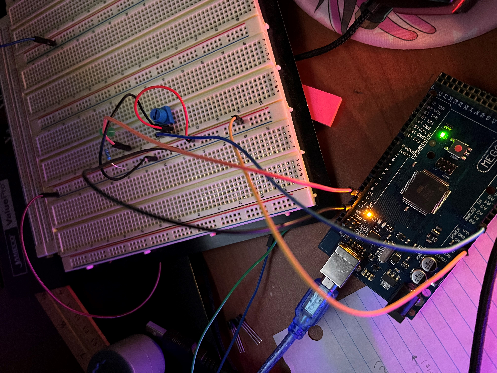
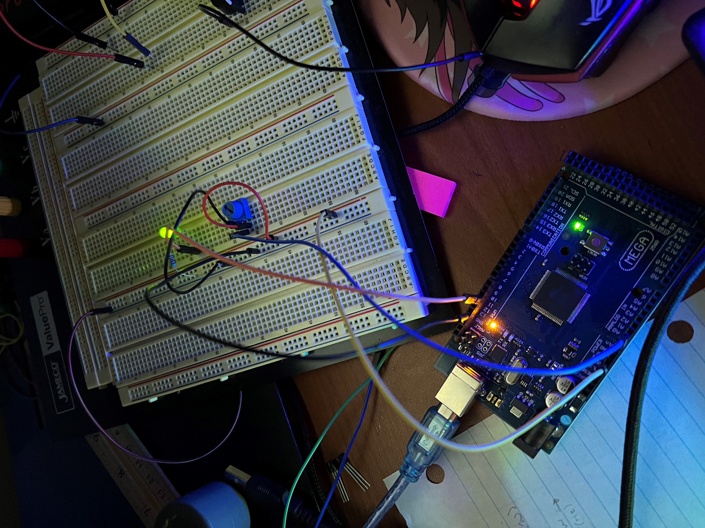
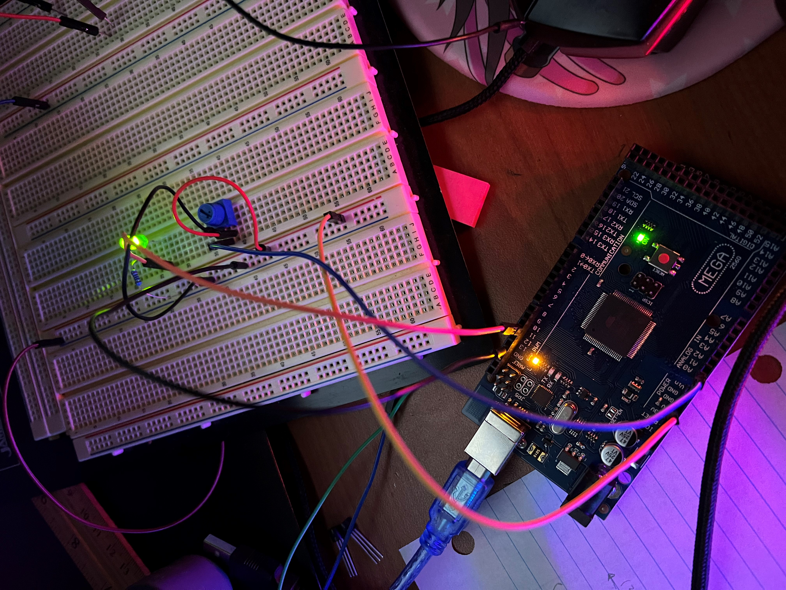

# AVR-based PWM Control of LED Brightness using ADC Input

This project demonstrates how to use the AVR microcontroller's Timer/Counter 1 to generate a Pulse Width Modulation (PWM) signal with varying duty cycle. The duty cycle of the PWM signal is controlled by an analog voltage read from an ADC pin, which is used to adjust the value of OCR1A through a potentiometer. The PWM signal is used to control the brightness of an LED connected to a digital output pin. The code initializes the pins, sets up Timer/Counter 1 for fast PWM mode with a 16-bit counter and 16-bit TOP value (ICR1), reads the analog value from the ADC pin, and adjusts the duty cycle of the PWM signal accordingly. The program uses the _delay_ms() function to create a 10ms delay between each cycle.

## Demo

### LED off

### LED Medium

### LED High

